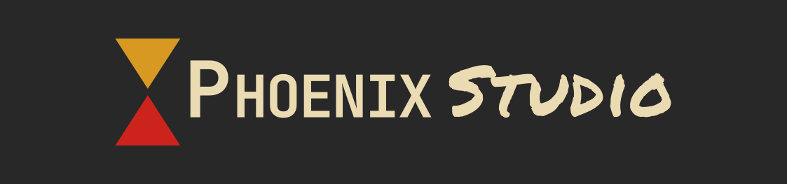

# _phoenix studio_
[](https://github.com/lmichaelis/phoenix-studio/actions/workflows/build.yml)


**Here be dragons! _phoenix studio_ is currently in very early development. Bugs are expected and might be very
common.**

_phoenix studio_ aims to implement a fully featured development environment for _ZenGin_ applications. The _ZenGin_ was
a game engine created by [Piranha Bytes](https://www.piranha-bytes.com/) for their early-2000s games
[Gothic](https://en.wikipedia.org/wiki/Gothic_(video_game)) and [Gothic II](https://en.wikipedia.org/wiki/Gothic_II).
Currently, it contains simple command-line utilities for reading and converting data files used for *Gothic* and 
*Gothic II*.

## contributing
If you'd like to contribute, please read [contributing](contributing.md) first.

## currently available tools
_phoenix studio_ comes with some tools to inspect and convert the _ZenGin_'s file formats. The following is a list of all
tools currently available:

| Name      | Description                                                                                                                                              |
|-----------|----------------------------------------------------------------------------------------------------------------------------------------------------------|
| `zdump`   | Dump information about various files.                                                                                                                    |
| `zmodel`  | Convert `MRM`, `MSH`, `MMB`, `MDL` and `MDM` files as well as world meshes into the [Wavefront](https://en.wikipedia.org/wiki/Wavefront_.obj_file) model |
| `zscript` | Display, disassemble and decompile  compiled _Daedalus_ scripts (similar to `objdump`).                                                                  |
| `ztex`    | Convert `TEX` files to `TGA`                                                                                                                             |
| `zvdfs`   | Extract and list contents of `VDF` files.                                                                                                                |

## building
_phoenix studio_ is currently only tested on Linux and while Windows _should_ be supported you might run into issues. If so,
feel free to create an issue or open a merge request. You will need

* A working compiler which supports C++17, like GCC 9
* CMake 3.10 or above
* Git

To build _phoenix studio_ from scratch, just open a terminal in a directory of your choice and run

```bash
git clone --recursive https://github.com/lmichaelis/phoenix-studio
cd phoenix
cmake -B build -DCMAKE_BUILD_TYPE=Release
cmake --build build
```

You will find the tool binaries in `build/bin` and the library in `build/lib`.

## licensing

While the source code of _phoenix studio_ is licensed under the [MIT license](license.md), the
[_phoenix studio_ logo](assets/project/logo.svg) is licensed under
[CC BY-NC 4.0](https://creativecommons.org/licenses/by-nc/4.0/).
